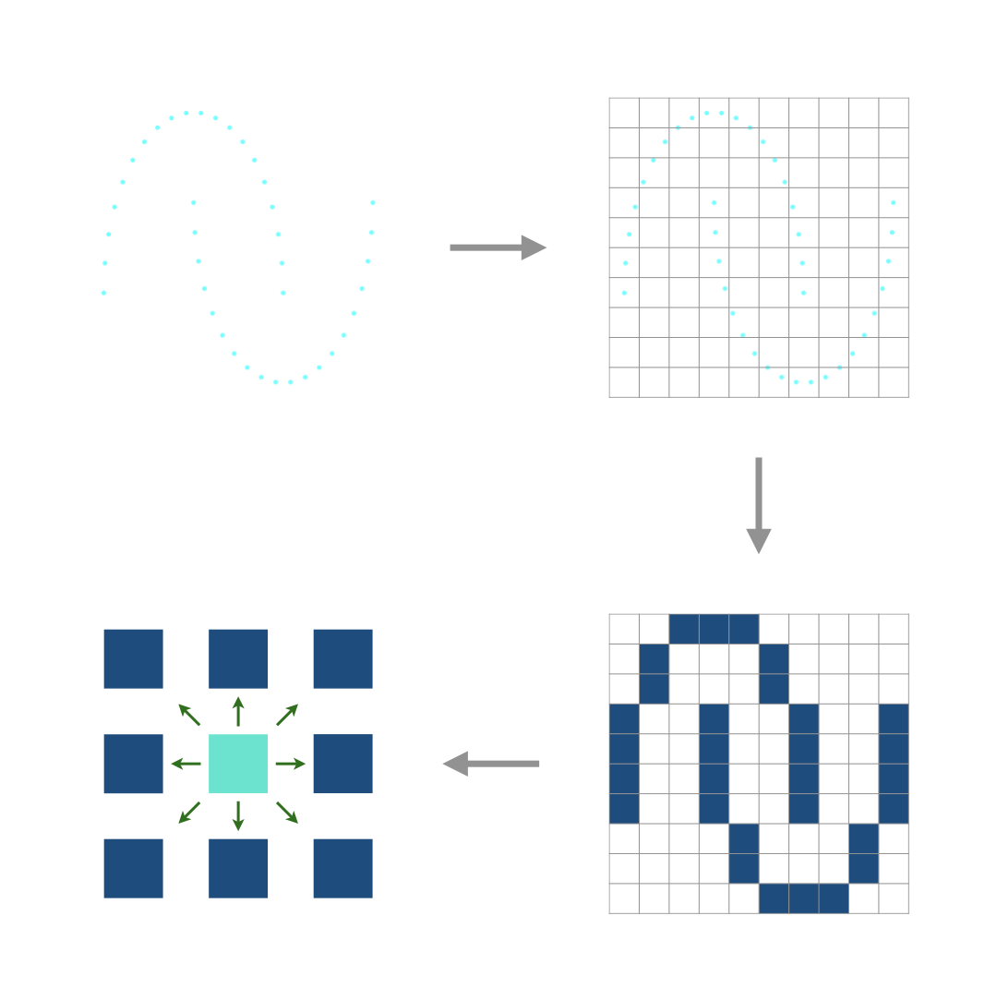
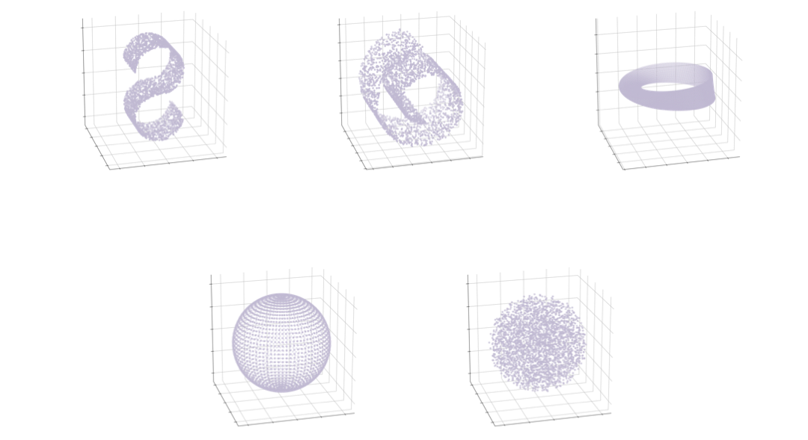
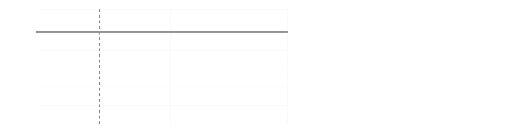

# CubeDimAE

### Introduction

As a proof-of-concept(PoC), this paper aims to reduce the wasted effort finding the proper size of the latent space in designing an autoencoder by estimating in advance the intrinsic dimension of a dataset. The estimation process was inspired by how human interpolates discontinuous set of points and imagine a continuous analogue in his/her mind. This is in contrast to the traditional approaches, which first assume the existence of some continuous manifold, seeing the dataset at hand as a finite sample from the infinite set, and try to guess the dimension of the manifold by examining various statistical properties of the sample.

### Files

 - **cubedimae.pdf**: The paper published at **BigComp2025** on February.
 - **cube_dim.py**: The implementation of the algorithm.
 - *experiment.py*: The experiment script used for the paper. `python experiment.py`
 - requirement.txt: The packages used for the implementation and experiment.

&nbsp;
&nbsp;
### Algorithm Overview
&nbsp;

To describe the algorithm in an intuitive manner,

1. Introduce a cubic grid on the data space.
2. "Color" the non-empty regions.
4. For every cube, count the adjacent cubes.
5. If the average count is near `3 ** k - 1`, we conclude the intrinsic dimension is *k*.

The rationale behind the expression is described in the paper in detail.

### Datasets

Datasets used in the experiment are as follows:

1. S-curve (2-dimensional)
2. Swiss roll (2-dimensional)
3. Mobius strip (2-dimensional)
4. Hollow sphere (2-dimensional)
5. Solid sphere (3-dimensional)

They are toy datasets whose complexities, or intrinsic dimensions, we all agree on.

### Accuracy

The dimension estimation algorithm correctly estimated the dimensions of all the datasets.

### Evaluation

When we do not know the proper latent dimension for the input dataset, we would try every possible values. However, we can save significant amount of time training if we know the optimal size of the bottleneck in advance.

- baseline: Trying every possible value, from 1 to 3.
- **CubeDimAE**: Estimation of the intrinsic dimension, followed by training the autoencoder *only* *once*, saving roughly 40% of time.

