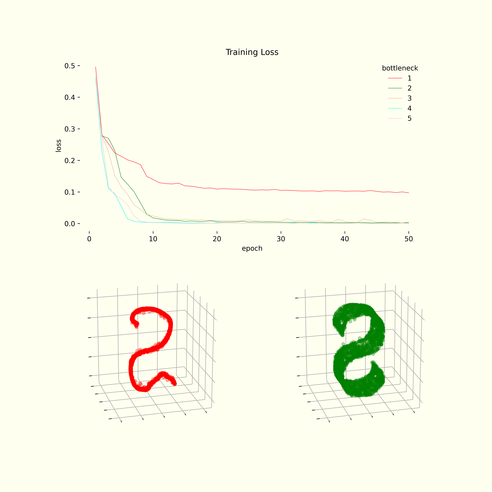
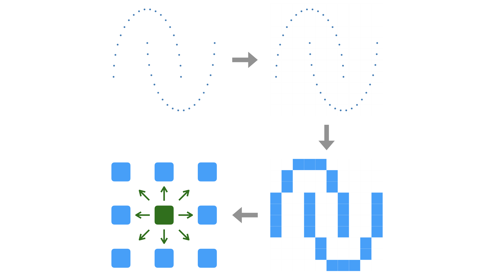
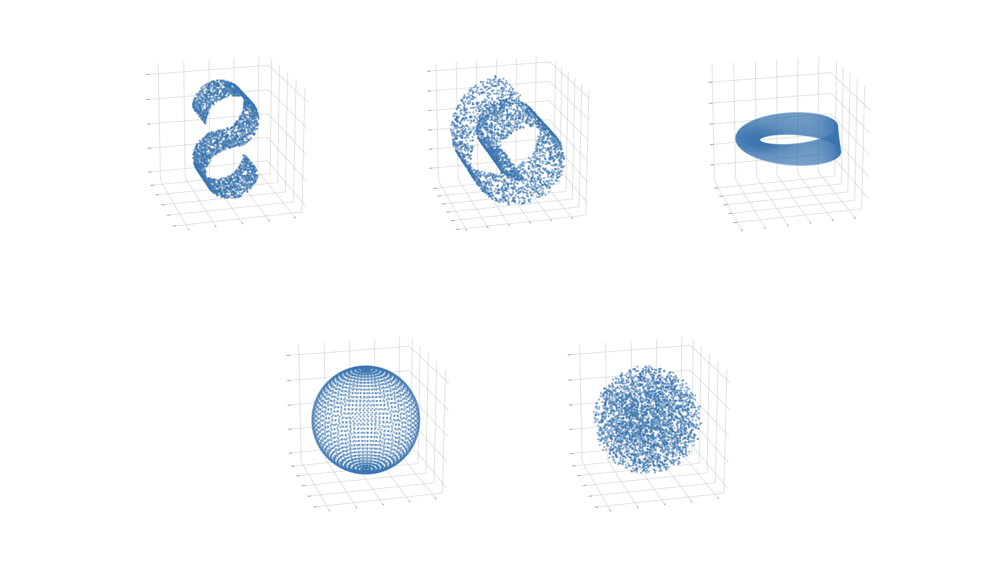

# CubeDimAE


## Table of Contents


1. [Introduction](#1-introduction)
2. [Contribution](#2-contribution)
3. [Motivation](#3-motivation)
4. [Overview](#4-overview)
5. [Datasets](#5-datasets)
6. [Evaluation](#6-evaluation)
7. [Usage](#7-usage)


### Files

- **cubedimae.pdf**: The paper published at **BigComp2025** on February.
- cube_dim.py: The implementation of the algorithm.
- experiment.py: The experiment script used for the paper.
- requirement.txt: The packages used for the implementation and experiment.
- requirement_frozen.txt: The versions used in the paper.
- materials: The figures and plotting script for this README.

⚠️  *The scripts are supplementary and were designed for internal experiments.*


## 1. Introduction


A proof-of-concept(PoC), this paper aims to reduce the wasted effort finding the proper size of the latent space in designing an autoencoder by estimating in advance the intrinsic dimension of a dataset. The estimation process was inspired by how human interpolates discontinuous set of points and imagine a continuous analogue. This is contrary to the traditional approaches, which first assume the existence of some continuous manifold (manifold hypothesis), seeing the dataset at hand as a finite sample from the infinite set, and try to guess the dimension of that manifold by examining various statistical properties of the sample.


## 2. Contribution


This work presents a method to estimate the intrinsic dimension of a dataset, which is known to be the optimal bottleneck of an autoencoder, and design an optimal network. Its feasibility has been validated on five datasets.


## 3. Motivation


Autoencoder's reconstruction performance drops drastically under the dataset's underlying complexity, which means the optimal size of the bottleneck is the dataset's intrinsic dimension. It was desirable to guess that value without trial-and-errors.


<div align="center">

### S-curve Case Study

<p align="center">
  
</p>

</div>


&nbsp;
## 4. Overview


To describe the algorithm in an intuitive manner,

1. Introduce a cubic grid on the data space.
2. "Color" the non-empty regions.
4. For every cube, count the adjacent cubes.
5. If the average count is near `3 ** k - 1`, we conclude the intrinsic dimension is *k*.

The rationale behind the expression is described in the paper in detail.





## 5. Datasets


Datasets used are as follows:

1. S-curve (2-dimensional)
2. Swiss roll (2-dimensional)
3. Möbius strip (2-dimensional)
4. Hollow sphere (2-dimensional)
5. Solid sphere (3-dimensional)

They are toy datasets whose complexities, or intrinsic dimensions, we all agree on.





## 6. Evaluation


### Accuracy


The algorithm correctly estimated the dimensions of all the datasets.


<div align="center">

| Dataset | Dimension | Estimated (exact) |
| --- | --- | --- |
| S curve | 2 | 2 (2.27) |
| Swiss roll | 2 | 2 (2.26) |
| Möbius strip | 2 | 2 (2.25) |
| Hollow sphere | 2 | 2 (2.33) |
| Solid sphere | 3 | 3 (2.87) |

</div>


### Efficiency


When we do not know the proper latent dimension for the input dataset, we would try every possible values. However, we can save significant amount of time training if we know the optimal size of the bottleneck in advance.

- baseline: Trying every possible value, from 1 to 3.
- **CubeDimAE**: Estimation of the intrinsic dimension, followed by training the autoencoder *only* *once*.


<div align="center">

### Baseline

| Dataset | AE1 | AE2 | AE3 | Total (*s*) |
| --- | --- | --- | --- | --- |
| S curve | 7.29 | 7.25 | 7.66 | 22.2 |
| Swiss roll | 6.92 | 7.06 | 7.34 | 21.32 |
| Möbius strip | 6.94 | 7.08 | 7.32 | 21.34 |
| Hollow sphere | 7.06 | 7.07 | 7.35 | 21.48 |
| Solid sphere | 6.97 | 7.09 | 7.33 | 21.39 |


### CubeDimAE (≈40% saved)

| Dataset | Estimation | AE | Total (*s*) |
| --- | --- | --- | --- |
| S curve | 3.2 | 7.25 | 10.45 |
| Swiss roll | 5.42 | 7.06 | 12.48 |
| Möbius strip | 3.03 | 7.08 | 10.11 |
| Hollow sphere | 5.67 | 7.07 | 12.74 |
| Solid sphere | 10.12 | 7.33 | 17.45 |

</div>


## 7. Usage


### Environment

Platform: Linux or Mac
<br>
Language: Python3.12

Packages:

```pip-requirements
numpy
scipy
matplotlib

pandas
tensorflow[and-cuda]; sys_platform == 'linux'
tensorflow; sys_platform == 'darwin'

tqdm
scikit-learn
```

or the versions used in the paper,

```pip-requirements
numpy==1.26.4
matplotlib==3.9.2

tensorflow[and-cuda]==2.18.0; sys_platform == 'linux'
tensorflow==2.18.0; sys_platform == 'darwin'

tqdm==4.66.6
scikit-learn==1.5.2
```


### Run

```bash
pip install --upgrade pip
pip install --upgrade --requirement requirement_original.txt

python3 experiment.py
```
