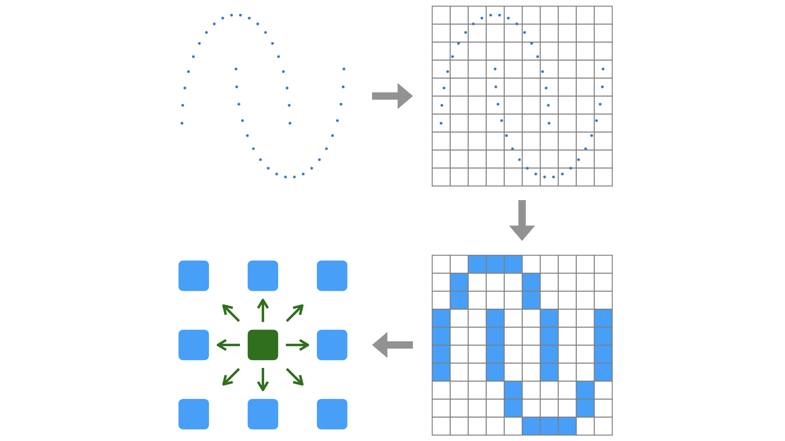

<div align="center">

# CubeDimAE: Automatic Autoencoder Generation based on Dimension Estimation by Tessellation

[](https://ieeexplore.ieee.org/document/10936902)
[](cubedimae.pdf)

</div>

## Contribution

⚙️ **Automation of the bottleneck tuning of autoencoder network.**

🎯 **100% accuracy on five synthetic benchmark datasets.**

🚀 **40% time saving in hyper-parameter tuning compared with the baseline.**

## How to Run

> [!NOTE]
> **_The scripts were written solely for reproducing the experimental results. They were not designed for reuse._**

### Environment

Platform: Linux or MacOS
<br>
Package Manager: Conda
```yaml
name: CubeDimAE
channels:
  - defaults
dependencies:
  - python=3.11.0
  - numpy=1.23.5
  - matplotlib=3.9.2
  - tensorflow=2.12.0
  - tqdm=4.66.5
  - pyyaml=6.0.2
  - scikit-learn=1.5.2
```

### Run

```bash
git clone https://github.com/sandwich-coder/CubeDimAE
cd CubeDimAE

conda update conda
conda env create --file environment.yml
conda activate CubeDimAE

python experiment.py --config config.yml
```

&nbsp;
## 📚 Table of Contents

1. [Introduction](#introduction)
2. [Motivation](#motivation)
3. [Overview](#overview)
4. [Datasets](#datasets)
5. [Evaluation](#evaluation)
6. [Citation](#citation)

&nbsp;
## Introduction

Autoencoder is the first choice in AI-based anomaly detection tasks. It has been recognized that the optimal bottleneck of an autoencoder is the intrinsic dimension of the input. Traditionally the optimal point is found through trial-and-error, putting large amount of time and effort into hyper-parameter tuning. This paper presents a method to estimate the intrinsic dimension in advance to automate the process. We have tested on five synthetic datasets as a proof-of-concept and shown its feasibility with 100% accuracy and 40% reduction in time.

## Motivation

Autoencoder's reconstruction performance drops drastically under the dataset's underlying complexity, which means the optimal size of the bottleneck is the dataset's intrinsic dimension. It was desirable to guess that value without trial-and-error.

<div align="center">

### S-curve Case Study

<p align="center">
  
</p>

</div>

## Overview

To describe the algorithm in an intuitive manner,

1. Introduce a cubic grid on the data space.
2. "Color" the non-empty regions.
4. For every cube, count the adjacent cubes.
5. If the average count is near `3 ** k - 1`, we conclude the intrinsic dimension is *k*.

The rationale behind the expression is described in the paper in detail.



## Datasets

Below are the datasets used.

1. S-curve (2-dimensional)
2. Swiss roll (2-dimensional)
3. Möbius strip (2-dimensional)
4. Hollow sphere (2-dimensional)
5. Solid sphere (3-dimensional)

They are toy datasets whose complexities, or intrinsic dimensions, we all agree on.


## Evaluation

The experiments were run on a Macbook M2 pro CPU.

### Accuracy

The algorithm correctly estimated the dimensions of all the datasets.

<div align="center">

Dataset | Dimension | Estimated (exact)
---: | :---: | :---:
S curve | 2 | 2 (2.27)
Swiss roll | 2 | 2 (2.26)
Möbius strip | 2 | 2 (2.25)
Hollow sphere | 2 | 2 (2.33)
Solid sphere | 3 | 3 (2.87)

</div>

### Efficiency

When we do not know the proper latent dimension for the input dataset, we would try every possible values. However, we can save significant amount of time if we know the optimal size of the bottleneck in advance.

- Baseline: Trying every possible value, from 1 to 3.
- **CubeDimAE**: Dimension estimation, followed by training the autoencoder *only* *once*.

<div align="center">

### Baseline

Dataset | AE1 | AE2 | AE3 | Total (*s*)
---: | ---: | ---: | ---: | ---:
S curve | 7.29 | 7.25 | 7.66 | 22.20
Swiss roll | 6.92 | 7.06 | 7.34 | 21.32
Möbius strip | 6.94 | 7.08 | 7.32 | 21.34
Hollow sphere | 7.06 | 7.07 | 7.35 | 21.48
Solid sphere | 6.97 | 7.09 | 7.33 | 21.39

### CubeDimAE (≈40% saved)

Dataset | Estimation | AE | Total (*s*)
---: | ---: | ---: | ---:
S curve | 3.20 | 7.25 | 10.45
Swiss roll | 5.42 | 7.06 | 12.48
Möbius strip | 3.03 | 7.08 | 10.11
Hollow sphere | 5.67 | 7.07 | 12.74
Solid sphere | 10.12 | 7.33 | 17.45

</div>

## Citation

```bibtex
@INPROCEEDINGS{10936902,
  author={Kim, Byungrok and Hwang, Myeong-Ha and Joo, Jeonghyun and Kwon, YooJin and Lee, Hyunwoo},
  booktitle={2025 IEEE International Conference on Big Data and Smart Computing (BigComp)}, 
  title={CubeDimAE: Automatic Autoencoder Generation based on Dimension Estimation by Tessellation}, 
  year={2025},
  volume={},
  number={},
  pages={20-25},
  keywords={Dimensionality reduction;Accuracy;Source coding;Autoencoders;Supervised learning;Noise;Estimation;Big Data;Unsupervised learning;Anomaly detection;autoencoder;intrinsic dimension;tessellation;dimension estimation},
  doi={10.1109/BigComp64353.2025.00013}}
```
